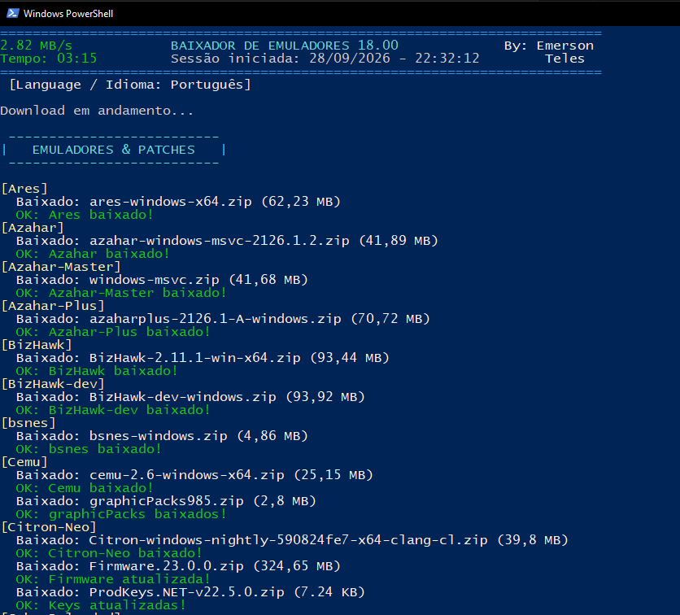
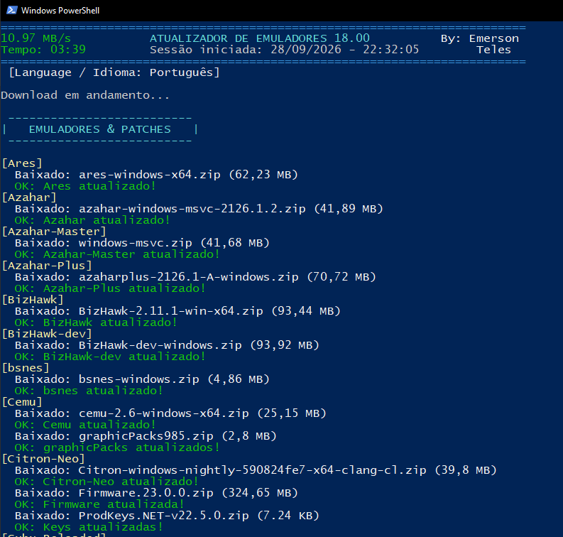

# 🕹️ Suíte Inteligente: Baixador e Atualizador de Emuladores (v18.00)

<p align="center">
  <a href="README-PT-BR.md"></a>
  <a href="README-EN.md"></a>
  <a href="LICENSE"></a>
  <a href="#-sistemas-e-softwares-suportados-56-motores"></a>
</p>

Suíte profissional e inteligente em **PowerShell** voltada para download autônomo, descompactação cirúrgica, extração e atualização silenciosa de um ecossistema com **56 emuladores de jogos, frontends e ferramentas de gerenciamento de ROMs** no Windows.

---

## 📸 Demonstração / Interface

<p align="center">
  
</p>

<p align="center">
  
</p>

---

## 🧠 Por que a Suíte é Inteligente?

A automação foi desenvolvida com recursos autônomos de nível profissional:
* **Detecção e Gestão Autônoma do 7-Zip:** Verifica se o 7-Zip está instalado ou desatualizado. Baixa e instala a versão oficial em segundo plano silenciosamente (`/S`) antes de iniciar os downloads.
* **Arquitetura Anti-Falha e Anti-Rate-Limit:** Possui raspador dinâmico de contingência (`Get-GitHubReleaseAssetsWeb`) que ignora limites da API REST do GitHub (HTTP 403), extraindo links diretamente do HTML limpo.
* **Blindagem Híbrida Inteligente (MEKA_Dual):** Consulta o AppVeyor CI por compilações contínuas (Nightlies). Se expirarem ou caírem, comuta 100% em silêncio para os lançamentos oficiais no GitHub sem alertas de erro.
* **Cache Inteligente de Sessão (Nintendo Switch):** Baixa Firmware oficial (324 MB) e Keys uma única vez e distribui localmente para `Ryujinx`, `Ryujinx-Canary`, `Eden` e `Citron-Neo`, poupando tempo e largura de banda.
* **Preservação Cirúrgica de Dados do Usuário:** No Atualizador, apenas arquivos `.exe` e `.dll` antigos são substituídos. Seus saves, arquivos de configuração (`.ini`, `.cfg`, `.json`), shaders, BIOS e perfis de controle permanecem rigorosamente intocados.
* **Ativação VIP Automática:** Injeção direta no Registro do Windows para desbloquear o Project64 e remover alertas de doação permanentemente.

---

## 📌 Diferenças entre os Scripts

* **`Baixador de Emuladores de Jogos 18.00.ps1` (Instalação Direta)**:
  * Utiliza a variável central `$Base = "C:\Emuladores"`.
  * Cria dinamicamente toda a árvore de diretórios e subpastas caso ainda não existam.
  * Baixa e descompacta tudo diretamente no disco `C:\`, sem necessidade de configurar caminhos manualmente.
  * Ideal para criar uma instalação portátil do zero ou estruturar um novo disco de jogos.
* **`Atualizador de Emuladores de Jogos 18.00.ps1` (Atualização de Instalação Existente)**:
  * Trabalha com **caminhos absolutos** pré-definidos para cada emulador.
  * No repositório oficial do GitHub, todos os links utilizam o marcador em inglês e em maiúsculo: **`PUT_YOUR_DIRECTORY_HERE`** (ex: `"PUT_YOUR_DIRECTORY_HERE\Nintendo Wii U\Cemu"`).
  * **Como configurar:** Abra o script no Bloco de Notas ou VS Code, pressione `Ctrl + H` (Substituir) e troque **`PUT_YOUR_DIRECTORY_HERE`** pelo caminho real onde seus emuladores estão instalados (ex: `D:\Games\Emuladores` ou `C:\Emuladores`).
  * **Como remover emuladores não utilizados:** Se você não possui determinado emulador instalado, basta **comentar a linha colocando `#` no início** ou simplesmente apagar a linha daquele emulador no final do script.

---

## 🌐 Suporte Multilíngue (10 Idiomas Nativos)

A versão 18.00 reconhece **automaticamente** o idioma do seu sistema operacional através de `[System.Globalization.CultureInfo]::CurrentUICulture`:

* 🇧🇷 **Português (`pt`)**
* 🇺🇸 **Inglês (`en`)** *(Fallback padrão universal)*
* 🇪🇸 **Espanhol (`es`)**
* 🇫🇷 **Francês (`fr`)**
* 🇩🇪 **Alemão (`de`)**
* 🇮🇹 **Italiano (`it`)**
* 🇯🇵 **Japonês (`ja`)**
* 🇨🇳 **Chinês Simplificado (`zh`)**
* 🇷🇺 **Russo (`ru`)**
* 🇰🇷 **Coreano (`ko`)**

### Como forçar manualmente um idioma:
```powershell
powershell -ExecutionPolicy Bypass -File ".\Atualizador de Emuladores de Jogos 18.00.ps1" -Lang es
powershell -ExecutionPolicy Bypass -File ".\Baixador de Emuladores de Jogos 18.00.ps1" -Lang en
```

---

## 📂 Sistemas e Softwares Suportados (56 Motores)

* **Nintendo (18)**: Citron-Neo, Eden, Ryujinx, Ryujinx-Canary, Cemu, Dolphin, Azahar (3 branches: Release, Master, Plus), DeSmuME, FCEUX, bsnes, Snes9x, SuperSnes9x, SuperZSNES, Project64, Rosalie's Mupen GUI (RMG), mGBA, Gearboy, VisualBoyAdvance-M.
* **Sony (7)**: shadPS4 (PS4), RPCS3 (PS3), PCSX2 (PS2), DuckStation (PS1), PCSX-Redux (PS1), PPSSPP (PSP), Vita3K (PS Vita).
* **Microsoft (5)**: Xemu (Xbox Clássico), Cxbx-Reloaded (Xbox Clássico), Xenia Master (Xbox 360), Xenia Canary (Xbox 360), Xenia Edge (Xbox 360).
* **Sega / Arcade / Retro (19)**: Flycast, Flycast Dojo, Deecy, Ymir (AVX2), Ymir (SSE2), FinalBurn Neo, MAME Oficial, MAMEUI Classic, MAMEUI Plus!, ARCADE64, MEKA, Mesen, jgenesis, GearSystem, etc.
* **Frontends & Gerenciadores (7)**: RetroArch, Playnite, EmulationStation-DE, Attract-Mode Plus, Xenia Manager, ClrMame, ClrMamePro.

---

## 🚀 Como Utilizar

1. **Pré-requisitos**:
   * Windows 10 ou 11 (64-bit).
   * PowerShell 5.1 ou superior.
   * Conexão estável com a internet.
2. **Execução Direta**:
   * Dê um duplo clique nos arquivos `.bat` (`Baixador-de-Emuladores.bat` ou `Atualizador-de-Emuladores.bat`), ou execute via terminal:
     ```powershell
     powershell -ExecutionPolicy Bypass -File "Atualizador de Emuladores de Jogos 18.00.ps1"
     powershell -ExecutionPolicy Bypass -File "Baixador de Emuladores de Jogos 18.00.ps1"
     ```

---

## 👨‍💻 Autor e Comunidade

Desenvolvido por **Emerson Teles**.

* 💬 **Discord Oficial:** [Servidor Oficial Emerson Teles](https://discord.gg/cnTxQhWWQp)
* ✈️ **Telegram de Mods:** [APKs & Mods Android](https://t.me/apksmodsandroid)
* ☕ **Apoie o Projeto no Ko-fi:** [ko-fi.com/emertels](https://ko-fi.com/emertels)
* 🐙 **GitHub:** [@Emertels](https://github.com/Emertels)

---

## 📄 Licença

Distribuído sob a licença **MIT**. Consulte o arquivo [LICENSE](LICENSE) para mais detalhes.
